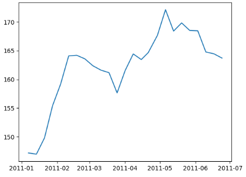

# Dow Jones Stock Analysis

A Python-based data analysis project that cleans and visualizes stock market trends using the Dow Jones Index dataset.

## Features
- **Data Cleaning:** Handles currency formatting and type conversion for stock prices.
- **Stock Tracking:** Visualizes price trends for IBM and Walmart (WMT).
- **Volume Comparison:** Generates pie charts comparing trading volumes for IBM, BAC, CSCO, and WMT.

## Installation
Ensure you have Python installed, then install the required dependencies:
- **Data:** Handles currency formatting and type conversion for stock prices.
- **Stock Tracking:** Visualizes price trends for IBM and Walmart (WMT).

```bash
pip install pandas matplotlib
```
## How To Use
1. **Clone the Repo:** Download the project files to your local machine.
2. **Data Source:** Download the project files to your local machine.Ensure `dow_jones_index.csv` is located in the same folder as the notebook.
3. **Open Notebook:** Launch Jupyter Notebook:

```bash
jupyter notebook
```
4. **Run Cells:** Open the `.ipynb` file and run the cells sequentially to generate the visualizations.

## Visualizations
The notebook generates several plots:
- **Line Charts:** Showing the price fluctuations of IBM and Walmart.
  
- **Pie Charts:** Distribution of trading volume for specific stock groups (IBM vs BAC and WMT vs BAC vs CSCO).

